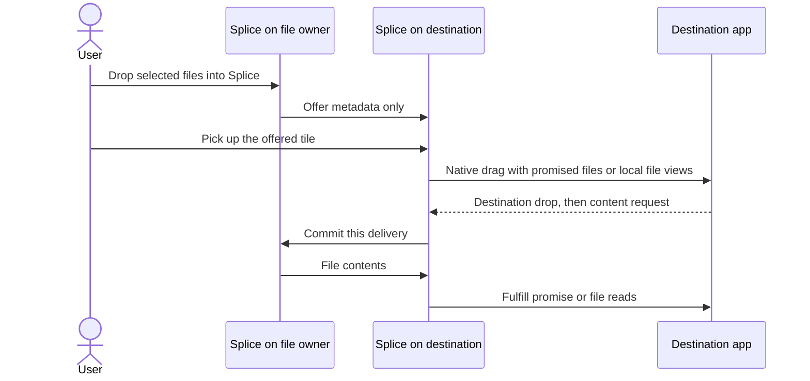

# File transfer, clipboard files and drag and drop

Research and proposed implementation, 2026-09-10. No feature code has been changed.
This plan applies to protocol 6, including the UDP input work now committed as `3f34852`.

## Recommendation

Build one file-offer and transfer service, with a small native Splice file shelf on each computer.
A file offer describes selected files and grants access to that selection. Creating or displaying
an offer transfers no file contents. A destination drop followed by a content request, or an explicit
Receive/Save action, commits a transfer. Copying is supported; cross-machine move and source deletion are excluded.

The user's clarified interaction is the baseline. Drop files into Splice at the source edge,
cross to the other computer, pick up the offered item there, and drop it into the desired app
or folder. Continuing the original held-button gesture is optional follow-up work.

On macOS, use AppKit file promises for the outgoing destination drag. On Linux, use native
Wayland drag and drop backed by a small read-only FUSE filesystem. The filesystem supplies
metadata immediately and supplies contents only after the destination drop commits. Ordinary
applications receive usable local file URLs; they do not need to understand Splice.

Also provide Save to… on every offer. It chooses a real destination directory and streams files
there without requiring a native outgoing drag or a virtual filesystem. This is an explicit action,
not an automatic substitution when a drag fails.

Start clipboard support with a clearly labelled Copy → Receive to clipboard → Paste flow on both
platforms. Native Copy detects the file selection and makes an offer. Receive is the explicit
commit; after download, Splice publishes actual local file URLs for normal Finder/Dolphin/Nautilus
paste. Fully transparent Ctrl+C/Ctrl+V for uncached files is a separate extension, especially on
macOS. Do not describe the initial extra-action flow as transparent clipboard synchronization.

## What exists today

| Code | Current behavior | Required change |
|---|---|---|
| `crates/splice-platform/src/macos/pasteboard.rs` | Maps text, HTML, RTF and PNG/TIFF. `normalize_drops_unknown_utis` explicitly tests rejection of `public.file-url`. Polls every 500 ms. | Read all file URL items as a selection; retain a local selection handle and native generation. |
| `crates/splice-platform/src/linux/datacontrol.rs` | Handles ext/wlr data-control, preserves most MIME names, fetches representation bytes. | Recognize file-bearing formats and resolve them on the source computer. |
| `crates/splice-platform/src/linux/clipboard.rs` | Same representation model through the Clipboard portal attached to RemoteDesktop. | File selection adapter, including local FileTransfer portal resolution. |
| `crates/splice-platform/src/lib.rs` | `Clipboard::read_local` and `ClipFetch` return `Vec<u8>` for a MIME representation. | Separate file selection and materialization interfaces. |
| `crates/splice-core/src/clipboard.rs` | Lazy representation broker, request IDs, five-second fetch deadline, bounded in-memory transfers. | Keep text/image transport; share clipboard ownership ordering with file offers. |
| `crates/splice-core/src/engine/inner.rs` | Clipboard Lamport ordering, per-offer requests and complete representation reads before chunking. | Route small file events to an independent service; never read, hash or copy files in the input actor. |
| `crates/splice-proto/src/lib.rs` | 16 MiB clipboard cap, 16 KiB chunks, 1 MiB frame cap, protocol 6. | New versioned file messages and a dedicated bulk protocol. |
| `crates/splice-platform/src/linux/overlay.rs` | Edge/input observation, with no `wl_data_device` drag implementation. | A coordinated file drop target, distinct from input capture. |
| `crates/splice-app/src/edge_indicator.rs` | Mac indication panel ignores mouse events. | A real registered native drag destination. The current indicator cannot receive files. |
| `crates/splice-app/src/drag.rs` | Machine-card arrangement in egui. | Leave this responsibility alone; it is unrelated to native file drags. |
| `crates/splice-app/src/{service,ipc,remote}.rs` | Linux service owns the engine; arrangement windows are disposable IPC clients. | File operations must outlive windows; native drag objects stay in the process that created them. |

Forwarding a Linux `file:///home/...` representation can forward a pathname, but cannot make its
contents exist on the Mac. Forwarding a portal transfer key is equally wrong: the key belongs to
the source machine's document portal. The current code has no file-content protocol, manifest,
receiver storage or native file-drag coordinator. The missing feature is deliberate in
[`docs/DESIGN.md`](../DESIGN.md), not an input transport failure.

Read-only inspection of `gamedev` found KWin/Plasma 6.7.4, Dolphin 26.08.0 and
xdg-desktop-portal 1.22.1. Its live Wayland globals include `wl_data_device_manager` v3,
`ext_data_control_manager_v1`, `zwlr_layer_shell_v1` v5 and `xdg_toplevel_drag_manager_v1`.
`/dev/fuse`, `fusermount3` and fuse3 3.18.2 are present. This Mac runs macOS 26.6.2.
These facts establish available building blocks, not a successful file-drag test.
The package/global capture is in `build/file-transfer-research/gamedev-capabilities.txt`.

## User interaction

### Drag through the edge

1. Drag one or more files or folders from Finder, Dolphin or Nautilus onto the Splice drop target.
2. Release to give Splice the selection. On Mac and KDE this can be an edge strip. The source
   drag ends as a copy; source files stay where they are. Merely hovering over the strip does
   not publish a persistent offer or send contents.
3. Splice sends the selected destination an offer containing names, types, sizes when known,
   origin identity and an offer ID. It does not send thumbnails extracted from file contents.
4. Move the cursor across normally. The destination shows a small file tile with the source,
   item count and names. The tile is metadata, not a placeholder file on disk.
5. Press and drag that tile into a folder or application. This is a new native drag originating
   in a real Splice view. The fresh press supplies the Wayland grab required to start it.
6. After a destination drop, commit when its consumer requests contents for that exact offer.
   Cancelling before such a request sends no contents. A later failure stops an active transfer;
   it cannot undo bytes already sent after the drop.
7. Show progress and cancellation in Splice. The receiving file manager or app owns its own
   import/copy operation and any final filename collision dialog.

Source-edge receipt and destination receipt are distinct. The first grants Splice access to an
explicit selection. The second authorizes network transfer. UI language must not say a file was
sent merely because it is available on the other shelf.

No automatic button-up/down synthesis is required for this flow. While a recognized native file
drag is over the source strip, input crossing must wait for that drop or exit. A source strip that
has not received a native file offer must not reinterpret an ordinary held mouse button as files.
The receiving tile remains available if the user moves away; crossing alone never downloads it.
Displaying a tile must not steal keyboard focus. A normal GNOME window or notification can expose
the available offer when automatic edge placement is unavailable. Drag offers do not replace the
clipboard; only the explicit clipboard flow does that.

Offer routing is deliberate. An edge strip names its currently linked destination and sends only
to that peer. A normal source window requires selecting a peer before releasing the files.
For clipboard offers, the input controller keeps an opaque owner/offer reference to the current
file selection. After a successful crossing it asks the owner to route the offer to the newly
controlled computer. The owner validates the current controller and recipient against sharing
policy before sending metadata. The user can also choose Send offer to… explicitly. File names
and trees are not broadcast to every Tailnet peer. A later crossing may create another targeted
offer, but does not retarget an existing shelf item or transfer.
If a layout/peer change invalidates the selected recipient before source drop, reject that drop.

### Clipboard files and explicit copying

Native Copy creates a clipboard-scoped file offer. On the other computer it appears in the same
shelf with Receive to clipboard and Save to… actions. Receive downloads to private staging,
verifies and commits the files, then writes destination-local file URLs to the clipboard. A normal
Paste then works in the local file manager, including menu-based Paste.

If another local copy occurs during receipt, completion must not overwrite that newer clipboard.
The completed files remain available in the shelf. The user can deliberately copy them again.
Clipboard managers and MIME probes must not start a transfer. Pending offers carry a private
Splice marker and a clear UI state; never expose old local file URLs as the new selection.

The extra Receive action is the initial compromise that keeps behavior identical across Mac,
KDE and GNOME and avoids downloading a multi-gigabyte selection inside a clipboard callback.
Later, on-demand file providers can remove that action. That later work must cover both keyboard
and menu-based Paste and must distinguish its weaker request-based intent model from the strict
accepted-drop gate used for drags.

Save to… commits directly to a user-chosen directory. It provides file copying even when a native
app does not accept file promises or when a Linux installation cannot run the FUSE presentation.
It also provides a straightforward receiver for directories and for large transfers.

## OS findings that determine the design

Apple supports reading multiple `NSURL` pasteboard items and restricting reads to file URLs.
Use that object API, rather than asking for one raw UTI value and losing all but one item.
See [readObjects](https://developer.apple.com/documentation/appkit/nspasteboard/readobjects(forclasses:options:))
and [file URL restriction](https://developer.apple.com/documentation/appkit/nspasteboard/readingoptionkey/urlreadingfileurlsonly).

An AppKit outgoing drag starts from a view and a mouse event. `NSFilePromiseProvider` supplies
an asynchronous file writer for a destination-selected URL. `NSFilePromiseReceiver` accepts
promised files from other apps. Promises belong to the dragging pasteboard; they do not prove
that Finder accepts an unresolved promise on the general clipboard. Apple also documents that
ordinary pasteboard reads can time out if a provider is slow.
Sources: [drag session](https://developer.apple.com/documentation/appkit/nsview/begindraggingsession(with:event:source:)),
[file promises](https://developer.apple.com/documentation/appkit/supporting-drag-and-drop-through-file-promises),
[pasteboard timeout](https://developer.apple.com/documentation/appkit/nspasteboard/data(fortype:)).

Wayland requires `start_drag` to name the caller's origin surface and an active matching implicit
grab serial. A drag offer can be read before drop, so receiving a MIME request does not prove
that the user dropped. The drag target gets offered data and decides what to do with it; the
protocol does not return its destination directory to the source. A new click on a Splice shelf
solves drag initiation without trying to move the originating application's native drag session.
Source: [Wayland protocol](https://wayland.freedesktop.org/docs/html/apa.html#protocol-spec-wl_data_device).

GTK exposes [GdkDrag::drop-performed](https://docs.gtk.org/gdk4/signal.Drag.drop-performed.html)
when an accepting client receives a drop. However, the underlying Wayland event explicitly permits a later cancellation, and GTK forwards
it directly. Treat it as a recorded physical drop, not a durable acceptance receipt. Require a
subsequent content read before granting content access. `dnd-finished` can depend on consumption;
waiting for it before serving data can deadlock. The callback ordering is a mandatory pilot gate.
Sources: [source-event definition](https://gitlab.freedesktop.org/wayland/wayland/-/blob/main/protocol/wayland.xml),
[GTK Wayland dispatch](https://github.com/GNOME/gtk/blob/main/gdk/wayland/gdkdrag-wayland.c).

Data-control and the Clipboard portal handle selections, not migration of a foreign drag.
`xdg_toplevel_drag_v1` lets a client move a window as part of its own drag. It is not a remote
file-drag API, even though `gamedev` advertises it.
Sources: [data-control XML](https://gitlab.freedesktop.org/wayland/wayland-protocols/-/blob/main/staging/ext-data-control/ext-data-control-v1.xml),
[Clipboard portal](https://flatpak.github.io/xdg-desktop-portal/docs/doc-org.freedesktop.portal.Clipboard.html),
[toplevel drag XML](https://gitlab.freedesktop.org/wayland/wayland-protocols/-/blob/main/staging/xdg-toplevel-drag/xdg-toplevel-drag-v1.xml).

Linux can expose remote files lazily through a real filesystem. GNOME Remote Desktop's
[RDP clipboard implementation](https://github.com/GNOME/gnome-remote-desktop/blob/master/src/grd-rdp-fuse-clipboard.c)
uses FUSE for this, as does [RustDesk's clipboard implementation](https://github.com/rustdesk/rustdesk/blob/master/libs/clipboard/README.md).
This is useful precedent for the filesystem architecture, not evidence that either project
solves Splice's cross-edge drag interaction. Write Splice's implementation independently;
Splice is MIT and those projects have different licenses. The Rust
[fuser library](https://github.com/cberner/fuser) offers a suitable MIT-licensed foundation.

The [FileTransfer portal](https://flatpak.github.io/xdg-desktop-portal/docs/doc-org.freedesktop.portal.FileTransfer.html)
exports existing local files to another local app, including sandboxed apps. Resolve incoming
keys on the source host. On the receiver, register receiver-local files or FUSE files and advertise
a new local key. `AddFiles` accepts files and directories through file descriptors; batch descriptor
lists and manage transfer lifetime explicitly. A source key is never a network capability.

### Platform delivery matrix

| Capability | macOS | KDE Wayland | GNOME Wayland |
|---|---|---|---|
| Native file clipboard selection | AppKit file URLs | Data-control plus local portal decoding | Existing Clipboard portal plus local portal decoding |
| Explicit receive/save and subsequent native Paste | Ordinary completed local files | Ordinary completed local files | Ordinary completed local files |
| Drop into a normal Splice window | AppKit destination | Native GTK drop target | Native GTK drop target |
| Edge drop strip | Nonactivating AppKit panel, pilot required | Layer-shell target, pilot required | No equivalent baseline layer-shell path; use a normal Splice window |
| Pick up destination tile | Real AppKit mouse event | Real Wayland press through GTK | Real Wayland press through GTK |
| Transfer after drop into another app | Individual file promises where supported; folders use Save to… or Receive then local drag initially | FUSE-backed local URLs, pilot required | Same FUSE-backed URLs, pilot required |
| Continue original held-button gesture | Optional experiment | Optional experiment | Separate compositor integration research |

GNOME's ordinary-window route is an explicit supported interaction. Do not advertise an edge strip
there until a maintained compositor integration exists. The layer-shell project's
[compatibility documentation](https://github.com/wmww/gtk4-layer-shell) excludes GNOME Wayland.
No GNOME shell extension, XWayland interception or global fullscreen overlay is part of the baseline.

## Implementation structure

Use a focused `crates/splice-core/src/files/` module with `offers.rs`, `manifest.rs`, `transport.rs`
and `storage.rs`. Its service owns tasks and files independently of the input engine. The engine
handles authorization, connection changes and small events. It holds no filesystem locks and
never waits for a transfer. Split into a crate only if dependency boundaries justify it later.

Add `crates/splice-proto/src/files.rs` for identifiers, bounded wire structures and validation.
Add `crates/splice-platform/src/files.rs` for native selection/drop events and native presentation
contracts. Core implements a range-fetch callback used by the Linux filesystem backend, analogous
in direction to `ClipFetch`, but streaming and explicitly authorized.

The source registry accepts only local native selections, source drops and file chooser results.
It returns opaque handles. The wire carries entry IDs, not absolute source paths. The receiver
cannot ask the source service to open an arbitrary pathname.

Important identities are separate:

- `FileOfferId`: random ID for a selection, including an originating process epoch.
- `EntryId`: one entry within an immutable manifest generation.
- `TransferId`: one accepted delivery to one recipient; repeated paste creates a new delivery.
- `NativeDragId`: one local drag attempt; a cancelled attempt cannot authorize a later one.
- File owner, input controller and current recipient: three machine IDs that can differ.

The last distinction matters when a Mac controls Linux A and the user drags a file from A to
Linux B. A owns and serves the file directly to B; the Mac supplies the gesture and coordination.
No file contents need to pass through the Mac.

Offer state is `Available`, `Revoked` or `Expired`. A delivery moves through `Preparing`,
`Committed`, `Receiving`, `Verifying` and `Ready`, or ends in `Cancelled`/`Failed`.
Only `Committed` authorizes content reads. A native drag ending is not a transfer completing.
An accepted transfer gets its own source lease so changing the clipboard cannot invalidate
an in-progress copy. Unaccepted clipboard offers expire on replacement; explicit shelf offers
remain until dismissal, expiry or source revocation.
For Linux drags, `DroppedAwaitingRead` is a native view/lease state, distinct from delivery state.
It reserves the source selection without content access and survives clipboard replacement, just
like an accepted transfer lease. It supports consumers such as browsers that read at form submission
rather than during the drop. Explicit authorization revocation still invalidates it.

## Network protocol

Keep input on its present UDP channels. Keep file contents out of `ClipChunk` and the shared
TCP control writer. Use a dedicated TCP listener on the Tailnet address, proposed port 41720.
A reliable, congestion-controlled stream is appropriate for complete file bytes. Using custom
reliable UDP here would duplicate transport work without fixing native file handoff.

Control messages on the existing authenticated peer connection should include:

| Message | Purpose |
|---|---|
| `FileOffer` / `FileOfferRevoke` | Recipient-scoped metadata, manifest generation and lifetime. |
| `FileClipboardRef` / `FileRoute` | Opaque current-selection reference to the input controller; validated request to offer it to one recipient after crossing. |
| `FilePrepare` / `FilePrepared` | Check selection availability and metadata limits; no content grant. |
| `FileCommit` / `FileGrant` | Bind one delivery to a recipient and issue its content capability. |
| `FileCancel` | Cancel one delivery, idempotently. |
| `FileResult` | Receiver-side durable result, distinct from native drop acceptance. |

The bulk connection starts with a fixed magic/version header, transfer ID and a random short-lived
single-use token exchanged on the control channel. Bind the token to both machine IDs, the control
connection generation, the offer generation and allowed entry IDs. Validate Tailscale WhoIs and
current policy before accepting it. Reconnection needs a fresh token. Bound unauthenticated
connections and expire their handshake. Bind only to the Tailnet interface.

After authentication, use bounded length-prefixed records: manifest pages, range requests,
range responses with entry/offset/request IDs, per-file completion hashes and explicit errors.
The receiver pulls. Its scheduler can prioritize ranges requested by a local app while continuing
the committed transfer into its cache. Cancel and terminal status have a reserved path so a full
bulk queue cannot prevent shutdown. Do not allocate a declared file length in memory.

Initial implementation budgets, to be measured rather than treated as OS requirements:
256 KiB data records, at most 4 MiB queued payload per connection, at most one send and one receive
per peer, two simultaneous transfers globally, bounded pending range requests and bounded manifest
pages. Opposite-direction copies must not hold a send slot while waiting to acquire a receive slot.
A slow reader stops granting range credit. Metadata enumeration runs in bounded filesystem
workers. There is no per-packet input timing work on these workers.

Separate sockets still share Wi-Fi queues. Add an interruptible byte-rate budget and pause file
reads under input transport degradation. Compare input latency with and without sustained transfer,
and tune an automatic rate policy from that result. Do not assume TCP congestion control alone
protects UDP input. File progress updates to UI should be throttled, for example to 5 Hz.

The new frames require the next protocol version, currently 7. Append new variants instead of
moving the initial Hello discriminator. All machines in a layout must run the matching release,
consistent with the repository's existing version policy. Distinguish mandatory base capabilities
from optional file capabilities: `supports_required_capabilities` currently treats everything in
`our_caps()` as required. Do not make unavailable native DnD or FUSE disable ordinary input.
Advertise `files-v1`, `file-clipboard-v1` and native presentation capabilities independently.

## Manifest, storage and correctness

A manifest is a selected set of roots and a tree of entry IDs, parent IDs, names, kinds, sizes,
modification times and source versions. Directory enumeration must be paged and cancellable.
Expose a total size only after enumeration is complete. Do not walk or hash arbitrary unrelated
files on hover. Use a metadata budget and return a precise limit error for an oversized tree.

Serve regular files and directories first, including empty files/directories and executable bits.
Preserve supported timestamps. Do not claim Finder tags, ACLs, resource forks, all xattrs or a
byte-for-byte portable application bundle in this initial format. Detect material unsupported
metadata and report it rather than silently promising full fidelity.

Support relative symlinks only when their targets stay inside the selected tree; create links
without following them. Reject escaping links and device nodes, sockets and FIFOs. Keep a test
for source directory replacement and symlink races. A portable filename policy must detect NUL,
separators, dot components, case collisions and normalization collisions at the destination.
Do not silently change a directory tree's names. Separate selected roots in staging so two roots
with the same basename do not collide before the native file manager handles their final names.

Use descriptor-relative traversal confined to selected roots. Retain source handles and record
inode/device/size/mtime or the platform's equivalent; revalidate before and after reads. A file
that changes during transfer fails with SourceChanged. A live directory is not an atomic snapshot;
freeze its enumerated manifest and fail if required entries disappear or change. Do not present
mixed old/new content as a successful copy.

Write into a private per-transfer directory with bounded disk admission and unpredictable internal
names. Stream into partial files. Hash with SHA-256 while receiving and compare the source's final
hash; the workspace already uses `sha2` in the updater. Sync completed files, write durable state
and atomically publish completed staging. For Save to…, stage on the selected destination filesystem
so the final rename stays local. Never overwrite a destination without that action's chosen
collision policy. Multi-root commits need per-root results; they are not globally atomic.

Transport retries cannot publish duplicate results. Track durable verified prefixes/chunks and
revalidate the source version before resuming. Initial releases can require an explicit Retry after
a disconnect; reuse verified data only when the stored generation still matches. Stale grants do
not authorize resume. Use progress deadlines, not the clipboard's two-second provider deadline
or the input channel's 750 ms safety timer.

Cache ownership has to outlive clipboard changes and drag UI dismissal. Accepted deliveries pin
data while native readers or file promises need it. Never collect an active mount, outstanding read,
promise or published clipboard selection. Completed received files remain recoverable through
Reveal/Save; app-retained FUSE paths depend on the Splice filesystem service remaining available.
Report that limitation and test service restart and stale-mount cleanup before shipping. A failed
or cancelled native import may leave partial output owned by the receiving app; Splice must not
traverse an unknown destination trying to remove it.

Use explicit retention rules. Unaccepted offers and dropped views awaiting their first read expire
after 24 hours without use, or sooner if the source revokes access; show their expiry in the shelf.
Completed received data and its committed filesystem views are not automatically evicted in the
initial release. They remain until the user clears those received files. Open readers, outstanding
promises and the currently published clipboard pin them against removal. Clearing a retained path
can invalidate an app's saved URL and must say so. Enforce disk quota by rejecting new receipts,
not by deleting potentially referenced completed data. Rebuild committed views from durable
records when the service restarts at the same runtime mount path. Existing file descriptors from
a crashed mount still fail; recreating the path repairs future opens, not those old descriptors.
No cross-login path guarantee is made. Keep portal keys with `autostop=false` for exactly the associated view lease and stop them
when it retires; document-portal access itself does not survive a desktop session.

## Native adapters

### macOS

Read file selections using `readObjectsForClasses` with `NSURL` and the file-URL restriction.
Read every item, check native clipboard generation before and after capture, and keep it separate
from the existing image/text normalization. Import promised source files through
`NSFilePromiseReceiver` after an actual source drop. Local materialization of a promised source
is distinct from network transfer and may be necessary before its contents can be offered.
Retain any security-scoped access with the source lease. Accessibility and Input Monitoring
do not replace filesystem permission checks; report a denied read through the file operation,
and use native chooser grants where appropriate.

Build the edge drop target and file shelf with AppKit on the main thread. They implement
`NSDraggingDestination` and register file URLs and promise receiver types. The existing mouse-ignoring
indicator panel cannot simply be renamed into this component. It may share geometry calculations.

A destination shelf item creates `NSDraggingItem` objects backed by `NSFilePromiseProvider`, with
copy as the only operation. Keep the provider and its transfer lease alive through every completion
callback. Return the promised basename promptly from `fileNameForType`; it is metadata, not a
request to transfer. Apple documents that `writePromiseTo` runs after the drag completes. Use
that request, scoped to a live drag attempt and copy operation, to commit the delivery. Fulfill
the supplied destination URL on a background operation queue. `NSFilePromiseReceiver` already
coordinates this writer callback with `NSFileCoordinator`, as the installed SDK documents;
do not nest another coordinator around that write. The
drag-ended callback records cancellation/result separately; it must not wait for file writing,
and the writer must not await that callback.
Verify this event ordering in the native pilot. On error or cancel, call each completion handler
exactly once with the actual error. Do not write empty success data.
Sources: [promise name callback](https://developer.apple.com/documentation/appkit/nsfilepromiseproviderdelegate/filepromiseprovider(_:filenamefortype:)),
[post-drag writer](https://developer.apple.com/documentation/appkit/nsfilepromiseproviderdelegate/filepromiseprovider(_:writepromiseto:completionhandler:)),
[background operation queue](https://developer.apple.com/documentation/appkit/nsfilepromiseproviderdelegate/operationqueue(for:)).

File promises are documented for several apps, but universal app support and folder promises are
not assumed. Test Finder folders and application file drop targets separately. An app that declines
promises gets a declined drop. Save to… and already-received local-file drags remain explicit actions.

For Receive to clipboard, publish one completed local file URL per pasteboard item and track the
self-write generation to stop echo. New content must not overwrite a more recent local copy.
Clipboard ownership is shared with text/image offers, not a second competing clipboard broker.

### Linux

Use a small native GTK4 file window in a dedicated `splice files` process. GTK's DragSource,
DropTarget and GDK file-list provider implement native drags; egui's arrangement drag is not suitable.
This adds a Linux GTK4 dependency but avoids carrying a private winit drag-source patch or writing
a second widget toolkit with raw Wayland. The main arrangement UI stays egui.

The Linux service continues owning transfer state, source handles, the cache and the filesystem.
The native helper owns GTK objects and Wayland serials. Its IPC carries offer IDs, state and bounded
commands, never serialized GTK objects or file contents. Add a descriptor-passing channel for source
files acquired through a local portal, with peer-credential checks and per-message descriptor limits.
Do not rely on a portal path remaining valid after its owning helper exits.

For KDE, a file edge target can use gtk4-layer-shell, coordinated with the existing input overlay so
there is one active input region at a crossing edge. The file target owns the area during a qualified
file drag; the input overlay owns ordinary crossing. Pilot this before committing to the extra
layer-shell library. A normal file window works without layer-shell, including on GNOME.
The pilot must include fast drags approaching the strip. Its geometry and callback ordering must
give native drag-enter priority before the input boundary fires, rather than assuming an active
foreign drag suppresses capture. Verify no mid-drag cursor jump or hidden source drop occurs.

Implement one long-lived service-owned read-only filesystem with `fuser`, mounted below the
user runtime directory. Each drag attempt gets a directory keyed by its random ID, unique inodes
within that mount, an offer generation and a commit gate. Do not create a mount per drag. `lookup`, `getattr` and
`readdir` use metadata. `read` serves verified cached bytes or schedules materialization through the transfer service.
Mount with user-only access and read-only, nodev/nosuid/noexec behavior; prohibit writes and link
creation from consumers. No global `allow_other` configuration or privileged Splice daemon is needed.

During drag hover, return the small local URI representation promptly. Those paths name the live
filesystem, not empty files. Do not start network reads, thumbnails or background prefetch before
commit. A pre-drop content read fails promptly with `EIO`; it never waits for a drop, returns zeros,
returns false EOF or queues a future transfer. Metadata-only opens and queries remain available.
Test the resulting consumer behavior because some apps inspect contents before accepting a drop. An app requiring file contents before accepting cannot meet the strict no-transfer
before-drop rule and must be reported as unsupported for an uncached offer.

Record `drop-performed` as `DroppedAwaitingRead` for that drag ID. The first content read
received in that state commits the delivery. An earlier read already failed and cannot become
a deferred authorization. Do not authorize on MIME `receive`, portal `RetrieveFiles`, hover,
drag start or `dnd-finished`. Serialize cancellation and read authorization: cancellation before
the first read retires the view and any unused grant with zero payload sent; cancellation later
stops the active transfer and reports interruption. Bytes already sent after a legitimate drop
cannot be recalled. This is the precise guarantee, rather than zero bytes for every eventual
receiver failure.

For the initial filesystem implementation, fully materialize and hash-verify each requested file
before its first content read completes. Metadata remains responsive and file I/O waits in
bounded workers, not the native main loop or input actor. This avoids exposing bytes before
the final whole-file check; a large file adds a receive wait to the consumer, shown in Splice
progress. Progressive verified-chunk serving is later optimization. Empty files/directories
need only validated metadata and no network contents. Distinguish Data ready from Saved by
another app; Wayland does not give Splice the final destination pathname or a durable-copy receipt.

For outgoing file selections, produce `text/uri-list` with correctly percent-encoded local URLs.
Use `x-special/gnome-copied-files` with `copy` and newline-separated URLs, without a trailing empty
entry, and `application/x-kde-cutselection` containing `0` for clipboard interoperability. Never
forward a remote cut marker or honor native move by deleting source files.
Sources: [Nautilus clipboard source](https://github.com/GNOME/nautilus/blob/main/src/nautilus-clipboard.c),
[KIO copy/cut source](https://github.com/KDE/kio/blob/master/src/widgets/paste.cpp).

Handle `application/vnd.portal.filetransfer` locally in both directions. Keep its key alive for
repeated requests as appropriate, and stop it when its presentation lease expires. The target's
portal grants access to receiver-local files. KDE's
[KUrlMimeData](https://api.kde.org/kurlmimedata.html) documents portal support and prefers portal
results when that representation is present, so an invalid portal key can break an otherwise valid
URI offer. Test sandboxed consumers early rather than advertising an untested representation.
Probe the local Documents/FileTransfer interface and actual export access. Native URI clipboard
support and portal-backed sandbox access are separate capabilities; lacking the latter must not
disable input or imply that every app can accept the offer. A declined sandbox drop is reported
as such, with Save to… available as an explicit action.

## Failure and lifecycle behavior

| Event | Required behavior |
|---|---|
| Hover, edge crossing, remote tile display | Metadata only; content byte counter remains zero. |
| Source drop, then user does nothing on destination | Offer remains available; no download. |
| Destination drag cancelled before a post-drop content read | Revoke that view and unused grant; no content transfer; shelf offer remains reusable. |
| Native target fails after post-drop reading began | Stop the active transfer; report failure and bytes already sent; preserve source. |
| Destination drop plus content request | Issue one grant and start transfer; repeated MIME reads cannot create new grants. |
| Source file changed, access denied or disk full | Fail explicitly; preserve source; no successful empty file. |
| Input focus moves elsewhere | Continue accepted file transfer. Cancel a native drag only if its input ownership becomes unsafe. |
| Panic, screen lock or native helper crash during drag | End drag and release input; revoke uncommitted attempts. Keep durable received data. |
| Connection lost | Fail/mark interrupted, resolve outstanding native requests with errors; retry requires reauthorization. |
| Clipboard replaced | Revoke unaccepted clipboard offer; keep independent committed transfers; do not overwrite new clipboard. |
| Master/file sharing disabled or authorization revoked | Invalidate unused tokens, revoke grants and stop relevant transfers; do not silently reconnect them. |
| Native target completed MIME exchange | Record native delivery separately from byte verification and destination-app save. |

## Implementation sequence and acceptance gates

1. Build isolated native pilots using only disposable files. Prove source receipt, destination tile
   pickup, accepted-drop callbacks and cancellation. On Linux, expose a tiny metadata-only FUSE file
   that permits real reads only after the drop event. On Mac, use a delayed file promise writer.
   Measure content byte counters while hovering and cancelling. This decides supported apps and
   confirms the strict commit gate before a large transport implementation is written.
2. Implement the file service and dedicated authenticated stream. Test manifest traversal, bounded
   memory, integrity, cancellation, reconnect and atomic storage. Add Save to… using a chosen local
   directory. This delivers useful file copying independently of native drag behavior.
3. Add file selection capture and the native file shelf. Wire Copy → Receive to clipboard → Paste
   with clipboard generation guards. Add multi-file/folder tests on Finder, Dolphin and Nautilus.
4. Connect native outgoing drags to the service: AppKit promises on Mac, FUSE-backed URLs on Linux,
   followed by local portal export for sandboxed apps. Advertise capabilities only for working paths.
5. Add Mac/KDE edge drop targets and coordinate them with input capture in both Raw and Desktop.
   Keep normal-window receipt available as an explicit action, including on GNOME. Test three-machine
   ownership with the physical input source different from the file owner.
6. Package GTK4/FUSE dependencies, helper IPC, cache/mount startup recovery and progress UI. Review
   the result across platform and transfer boundaries, then run native acceptance on both desktops.
   Current Flatpak packaging is not proof of support: host-visible FUSE mounts and portal access
   must be validated separately. Do not advertise that capability from inside an isolated mount
   namespace until a supported host integration exists.
7. Only after these paths work, prototype continuous held-button handoff and fully transparent
   uncached-file clipboard paste. Neither is required for the user's clarified drag interaction.

Critical test matrix:

- Mac ↔ KDE, Mac ↔ GNOME and KDE ↔ GNOME, with both Raw and Desktop input.
- Finder/Dolphin/Nautilus folders, a GTK app, a Qt app, a browser upload target and a sandboxed app.
- Two files with the same basename; nested/empty directories; zero-byte files; a file over 4 GiB;
  a large tree; Unicode, spaces, newlines, percent signs and case/normalization collisions.
- Hover for 30 seconds, MIME probing, portal key retrieval, thumbnail requests, Escape and rejected
  drops all leave network file-content bytes at zero before commitment.
- Release the physical mouse at the source strip, cross, pick up at the target; no phantom press,
  stuck button, unwanted input capture or accidental transfer in either mode.
- Source change/delete, permission denial, disk full, app crash, service crash, Wi-Fi loss,
  duplicate commit/result messages, stale tokens and cancellation while hashing or reading.
- Copy replaces copy while enumeration/receipt is running; repeated paste; clipboard-manager echoes;
  a third computer becomes the input controller during an accepted transfer.
- Full-rate large-file transfer alongside 125/500/1,000 Hz pointer motion, key transitions and
  boundary returns. Compare matched baseline/treatment latency distributions and report throughput.
  Existing network jitter must not be mistaken for a new input queue delay.

## Alternatives and remaining decisions

| Approach | Assessment |
|---|---|
| Increase the clipboard byte cap | Does not transfer a pathname's contents or implement native drag ownership. |
| Put files on the existing control socket | Risks delaying session control and grows the clipboard broker into a file server. |
| Invent reliable UDP file transport | Unnecessary initial work. Dedicated TCP already provides reliable streaming; QUIC is a later measured choice. |
| Copy bytes as soon as a cursor crosses | Violates the requested commit rule. |
| Write a tiny fake file/handle and replace it wherever the user drops it | A normal Wayland source does not learn that location. Also leaks a fake artifact if anything fails. |
| Infer destination from window titles or script Finder/Nautilus/Dolphin | Cannot serve arbitrary receiving apps and is too dependent on UI details. |
| Share a whole disk over SMB/SFTP/WebDAV | Larger access scope and configuration than an explicit finite selection. |
| FUSE-backed file views on Linux | Appropriate for native consumers reading files after drop; adds mount lifecycle and packaging obligations. |
| macOS FSKit/File Provider for all file clipboard offers | Potential route to transparent lazy Paste, but adds an app extension, signing, activation and filesystem/provider lifecycle. Keep outside the initial shelf implementation. |

Apple's [replicated File Provider](https://developer.apple.com/documentation/fileprovider/replicated-file-provider-extension)
models remote files with system-managed local copies. [FSKit](https://developer.apple.com/documentation/fskit)
provides user-space filesystem app extensions. They deserve separate prototypes if one-action paste
of uncached Mac files becomes a requirement. Neither is necessary to implement the file shelf and
asynchronous native promise drag described here. Do not add a macFUSE/kernel-extension dependency
for the initial feature.

For that later work, prototype File Provider first because its domain model already represents
remote documents with system-managed local copies. FSKit's `FSGenericURLResource` is another
option on macOS 26.0 and later, including this Mac; FSKit itself starts at 15.4. Both require an
embedded extension and its lifecycle, with additional signing/activation work. The repository has
no explicit declared Mac deployment floor, so adopting either is a packaging decision, not just
a new Rust dependency. Use released SDK APIs, not the newer beta handler APIs in current web docs.
Sources: [File Provider synchronization](https://developer.apple.com/documentation/fileprovider/synchronizing-the-file-provider-extension),
[FSKit URL resource](https://developer.apple.com/documentation/fskit/fsgenericurlresource),
[FSKit extension sample](https://developer.apple.com/documentation/fskit/building-a-passthrough-file-system).

The main remaining engineering uncertainty is application behavior around pre-drop content reads,
not whether TCP or UDP can move a file. The native pilot has a concrete pass condition: the drop is
accepted, zero content crosses beforehand, the completed destination bytes match, and cancelling
leaves both input and the source files intact.

Kimi K3 reviewed this plan through Baton and approved it after the commit gates, pre-drop read
errors, routing and retention rules were made explicit. The review verified repository facts and
protocol semantics; it did not run native file-drag pilots. Those pilots remain the first
implementation step.
